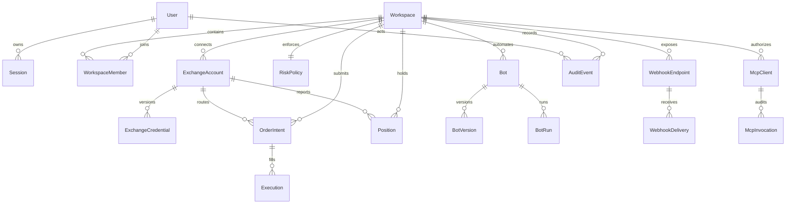

# ER Diagram

```mermaid
erDiagram
  User ||--o{ Session : owns
  User ||--o{ WorkspaceMember : joins
  Workspace ||--o{ WorkspaceMember : contains
  Workspace ||--o{ ExchangeAccount : connects
  ExchangeAccount ||--o{ ExchangeCredential : versions
  Workspace ||--|| RiskPolicy : enforces
  Workspace ||--o{ OrderIntent : submits
  ExchangeAccount ||--o{ OrderIntent : routes
  OrderIntent ||--o{ Execution : fills
  Workspace ||--o{ Position : holds
  ExchangeAccount ||--o{ Position : reports
  Workspace ||--o{ Bot : automates
  Bot ||--o{ BotVersion : versions
  Bot ||--o{ BotRun : runs
  Workspace ||--o{ WebhookEndpoint : exposes
  WebhookEndpoint ||--o{ WebhookDelivery : receives
  Workspace ||--o{ McpClient : authorizes
  McpClient ||--o{ McpInvocation : audits
  Workspace ||--o{ AuditEvent : records
  User ||--o{ AuditEvent : acts
```

The full cardinality, indexes, data types, deletion semantics, and constraints are defined by the Prisma schema rather than the diagram.
